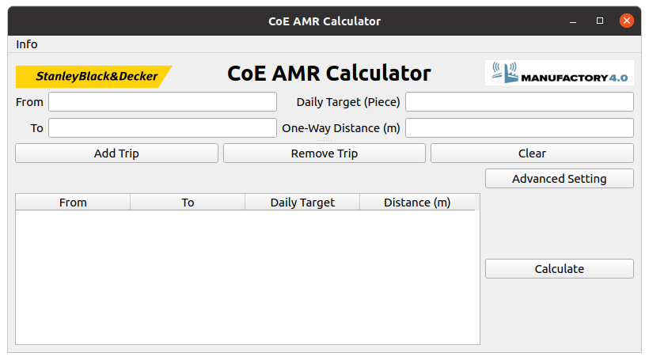
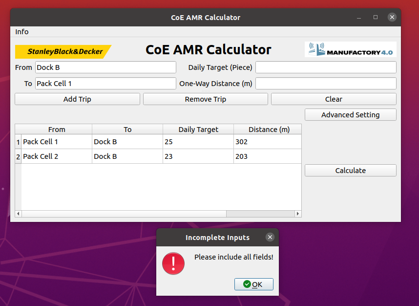
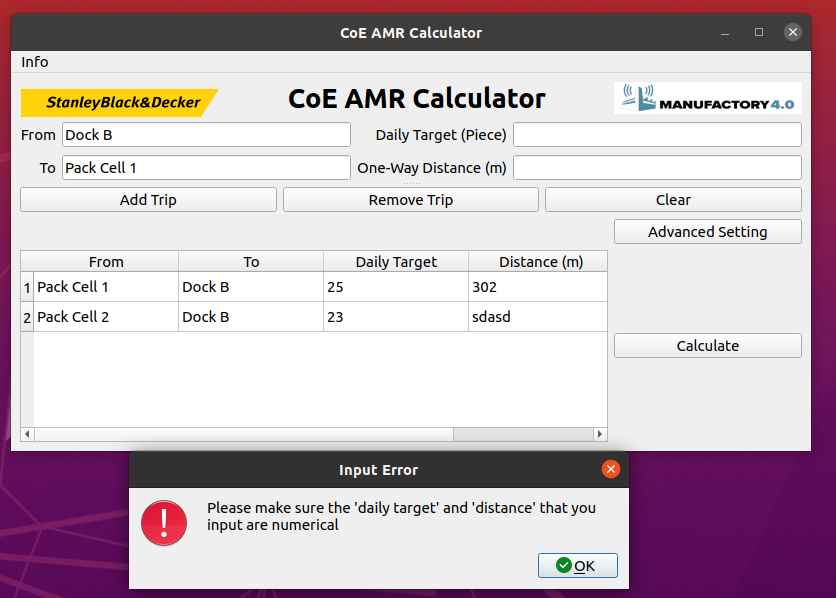
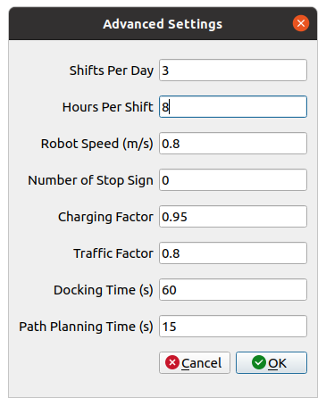
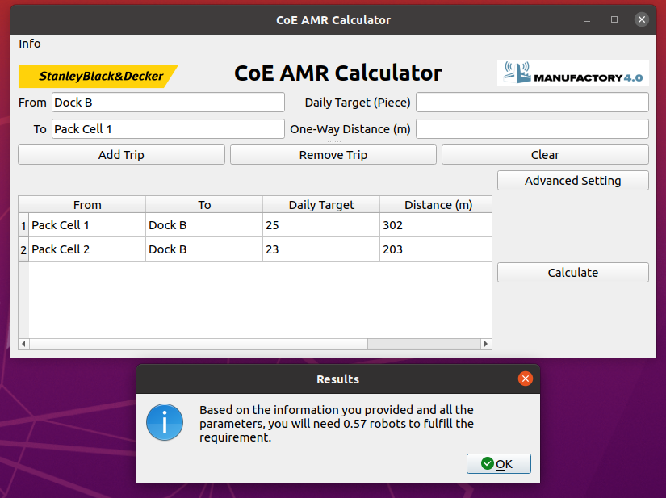

# Robotcalculator_pyqt5
I created this GUI application and algorithms to calculate the number of Automomous Mobile Robots required in a flexible manufacturing systems.

To use this application, you need to know:
1. From where
2. To where
3. Daily Target (Pallet)
4. Distance (m)

## This is a demo

## This is a demo to show it handle incomplete inputs

## This is a demo to show it handle input type error

## This is a demo that you can dial in more advanced parameters to suit your operation.

## When you input valid data and hit `calculate`, the application will give you the result

